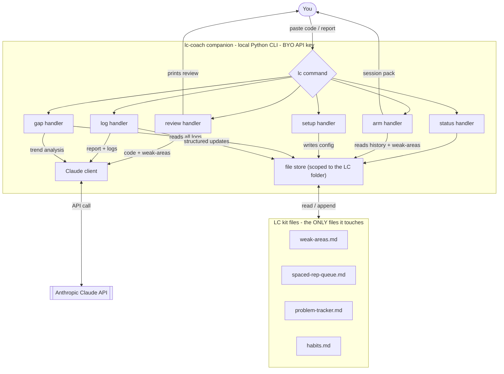
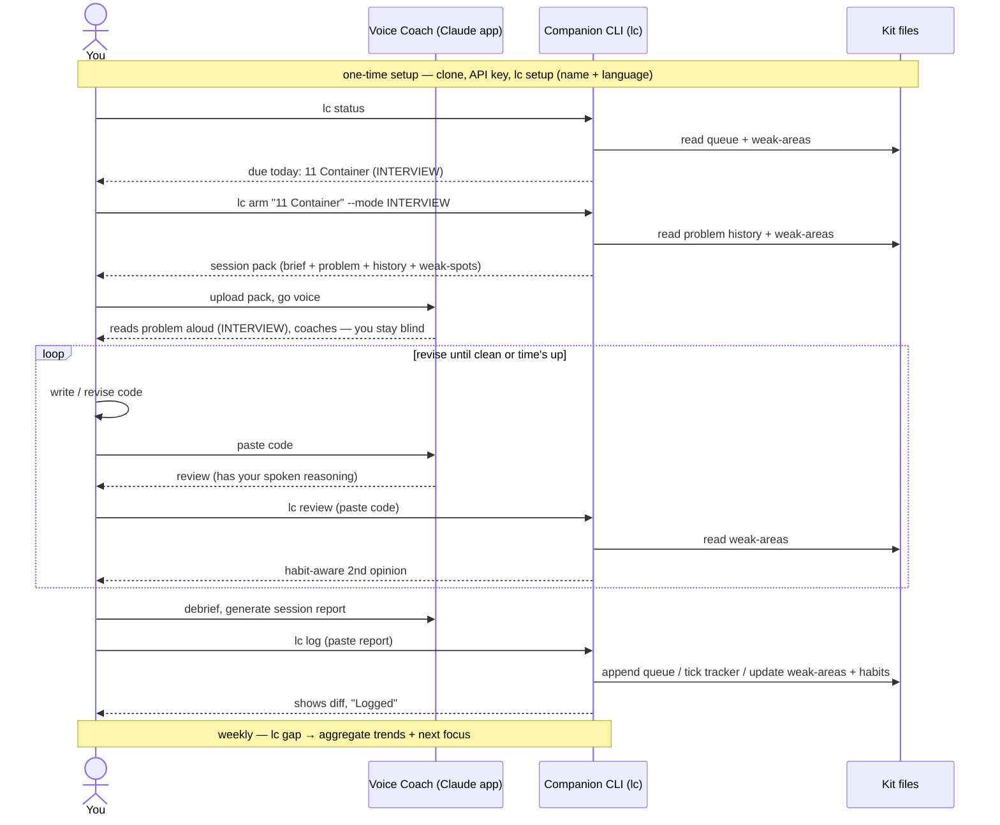

# LC Coach Companion — System Design (MVP)

A small, local CLI that handles the **second half** of the [LC Coach Kit](README.md) loop: a **habit-aware code review** + **session logging** into the kit's `logs/` files — fully automated, nothing else to wire up. **Implemented as [`lc.py`](lc.py) in this repo** (~400 lines, one dependency).

> **Scope discipline (read first):** this is a *contained weekend build*, not a platform. It's a **build** — ship a small MVP, time-boxed, then stop. The non-goals are load-bearing.

---

## 1. Purpose

| Problem | This tool |
|---|---|
| Hand-maintaining the logs and getting a code-specific second opinion is manual | One tiny local CLI automates both, scoped to *only* your LC files |
| The voice coach (Claude app) can't write to your local log files | This can — append to the queue, tick the tracker, add a weak-area tag |
| You want a clean, shippable artifact in the agentic / LLM-dev-tooling lane | This *is* one: a scoped local agent that reviews code against tracked context and writes structured logs |

## 2. Scope & non-goals

**In scope (MVP):** local Python CLI · bring-your-own `ANTHROPIC_API_KEY` · operates on one configured folder (a clone of `lc-coach-kit`) · commands `setup` / `arm` / `start` / `stop` / `review` / `log` / `status` / `gap`.

**Explicit non-goals (do NOT build in MVP):** hosting / multi-user / auth · a database (the markdown files *are* the store) · a web UI (CLI only; web wrapper is maybe-v2) · doing the voice coaching (stays in the Claude app) · touching any file outside the configured LC folder.

## 3. Architecture



## 4. Commands

```
# one-time SETUP — pick your language(s) + name
lc setup
   # prompts: name (optional) · primary language · optional 2nd (diagnostic) language
   # writes config the other commands read; tailors the standards gate + review

# ARM the voice coach with a problem → outputs a "session pack" to upload
lc arm "11 Container With Most Water"
   --mode INTERVIEW           # coach delivers it verbally; you stay blind
   # session pack = brief + problem statement + your prior attempts + weak-spots
   # upload THAT to the Claude voice session (not the bare brief)

# TIMER — auto-started by `arm`, auto-stopped by `log` (explicit control if needed)
lc start                      # start the session timer (start time + problem)
lc stop                       # stop → elapsed feeds "time vs 50-min cap"

# paste code; prints a habit-aware review (uses weak-areas.md) — iterate as you revise
lc review
   --problem "1 Two Sum"      # optional, sharpens the review
   --file solution.cpp        # alternative to pasting

# paste your session report; updates the log files
lc log                        # appends spaced-rep-queue, ticks tracker,
                              # updates weak-areas tag, appends habits row (auto-stops timer)

# prints spaced-rep items due today/overdue + flagged weak areas
lc status

# GAP ANALYSIS — review accumulated logs, find trends, prescribe next focus
lc gap                        # reads weak-areas + spaced-rep history + habits across sessions
                              # prints aggregate gaps + next-week adjustment; appends gap-analysis-log.md
```

Input by paste (stdin, Ctrl-D) or `--file`. Output to terminal; `log` also writes files and prints a diff of what changed.

**Arming the coach** is what makes INTERVIEW mode work — the coach needs the problem statement to read it aloud while you stay blind. **Two problem sources, both clean:** the coach can *assume the problem itself* (recall/pose one — good for varied practice, may paraphrase), or you *paste the exact problem* (**recommended** — full fidelity). **No embedded problem bank** — the kit ships the problem *list* (titles in `problem-tracker.md`), never the copyrighted statements; no scraping. (Optional opt-in `--fetch` is a v2 idea, never the default.)

**Session timing is automatic** off the system clock — no hook needed (a hook only matters for giving a *conversational* AI time-awareness; a CLI reads the clock directly). `arm` starts it, `log` stops it, elapsed lands in the report's "time vs cap."

**The review loop iterates** — paste → review → revise → paste again, until clean or time's up. Not a single pass.

## 5. User journey



### The two modes
- **TEACH** — learning/stuck. Complexity warm-up quiz first, problem shown, Socratic nudges *toward* the insight (coach helps you get there).
- **INTERVIEW** — performing. Verbal delivery, restate-cap of 2, you stay blind, self-example → pseudocode → code, coach silent + probes only ("sure that handles X?"), no help. Debrief catches the bugs.

## 6. Data model

No database — the **markdown files are the store**:
- `weak-areas.md` — tag table (read for review; appended on log)
- `spaced-rep-queue.md` — active queue (appended on log; read for status)
- `problem-tracker.md` — checkboxes (ticked on a clean solve)
- `habits.md` — daily rows (appended on log)
- `config.md` — name + language(s) from `setup`
- `gap-analysis-log.md` — dated aggregate-review entries (appended by `gap`)
- `problems/<id>.md` — *optional* personal problem statements (read by `arm`; never committed)
- `.session` — timer state (set by `start`/`arm`, cleared by `stop`/`log`)

## 7. Tech stack

**Python 3.10+**, stdlib + the **`anthropic`** SDK. No web framework, no DB, no async — one package dependency. Config via env (`ANTHROPIC_API_KEY`, optional `LC_DIR`).

## 8. Setup

```bash
git clone <repo>/lc-coach-kit && cd lc-coach-kit
pip install anthropic
export ANTHROPIC_API_KEY=sk-...        # your own key
python lc.py setup                     # name + language(s) → writes config
python lc.py status                    # verify it reads your files
```

## 9. Build estimate (keep it contained)

| Piece | Rough size |
|---|---|
| CLI + config + file store (scoped read/write + path guard) | ~120 lines |
| Claude client + 3 prompts (review, log-extract, gap) | ~110 lines |
| 6 command handlers (setup/arm/review/log/status/gap) + diff print | ~160 lines |
| **Total MVP** | **~390 lines · one focused weekend** |

If it's growing past this, you're building v2 — stop and ship.

## 10. Guardrails

- **Path-scoped:** the file store refuses any write outside the configured LC folder.
- **Diff-before-write:** `log` shows the change (and can confirm) before saving — a mis-parsed report can't corrupt the logs.
- **Read-only review:** `review` never writes.
- **BYO key:** no shared credentials, no hosting cost.
- **No copyrighted content:** ships the problem list, never the statements; no scraping.

## Safety & trust — is it safe to run?

A fair question for any AI tool with file access + network calls. Why you can trust it:

- **It's open source.** ~390 lines you can read end to end — no hidden behavior, no obfuscation.
- **The AI never executes anything.** It only returns *text* (a review, or structured log data). The tool's own deterministic code does the file writes — no `eval`, no running the model's output as code or shell commands.
- **File access is hard-scoped.** The file store refuses any path outside your LC folder. It cannot read or write the rest of your machine.
- **Read-only review.** `review` never writes — it only prints.
- **You approve every write.** `log` shows a diff of the proposed change (and can confirm) before saving — a bad parse can't silently corrupt your logs.
- **You control what leaves your machine.** Only the code/report you paste + the kit files (sent as context) go to the Anthropic API, under *your own* key. No telemetry, no other network calls, no third-party servers.

In short: a small, readable, local tool that talks to exactly one API (with your key), writes only inside one folder, and never runs AI output as code. You can verify every line.

## 11. Future (OUT of MVP)

- A one-file local **web UI** wrapper (friendlier than CLI for non-terminal users)
- Auto-detect "due today" and nudge
- A `coach` command that does the *voice* loop too (only if you ever collapse the two AIs into one)
- Optional `--fetch` for `arm` — pull problem text from LeetCode's GraphQL on demand. **Opt-in, never the default**; accepts the ToS/fragility tradeoff; doesn't bundle content.

Park these. Ship the core commands first.
